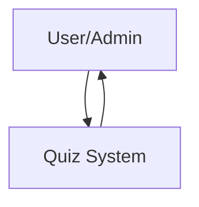
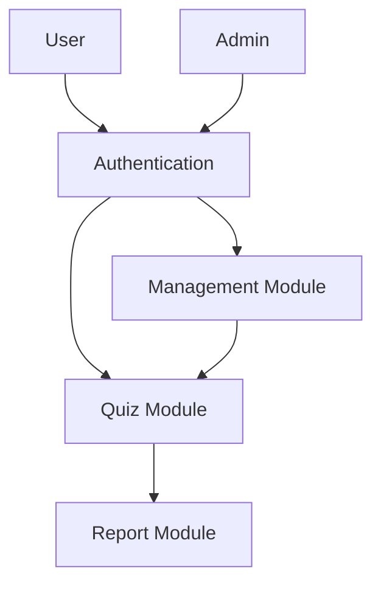
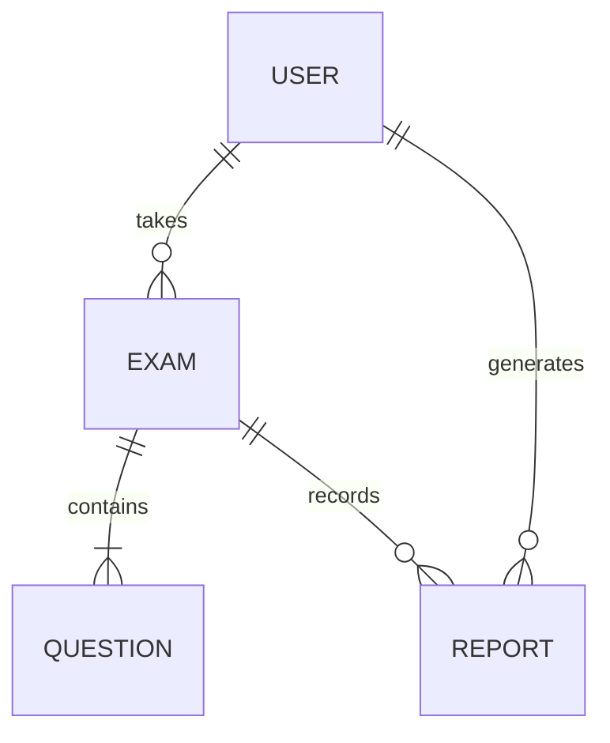
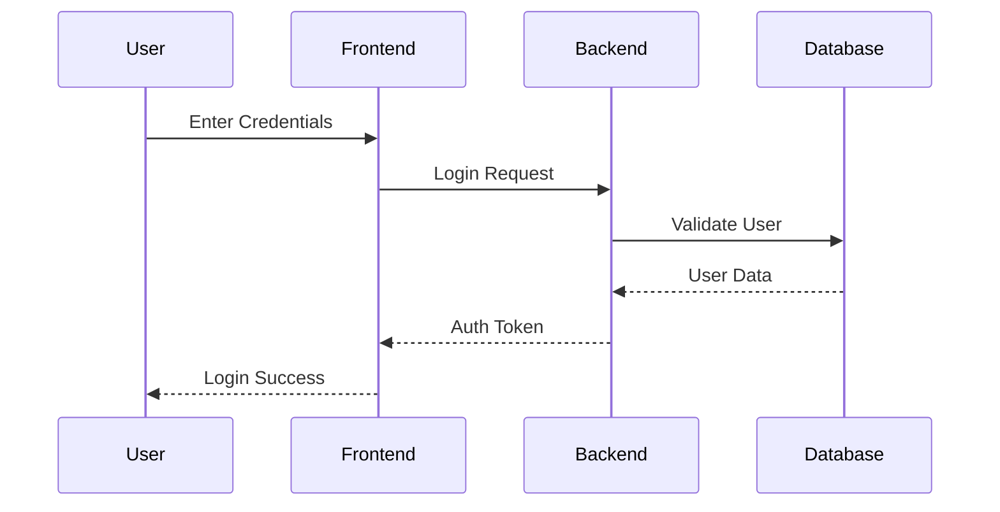

# Quiz Platform Documentation (Extended)

## Table of Contents
1. [Introduction](#1-introduction)
2. [Features](#2-features)
3. [Technology Stack](#3-technology-stack)
4. [System Architecture](#4-system-architecture)
5. [Diagrams](#5-diagrams)
6. [Database Design](#6-database-design)
7. [API Documentation](#7-api-documentation)
8. [Security](#8-security)
9. [User Interface](#9-user-interface)
10. [Testing](#10-testing)
11. [Deployment](#11-deployment)
12. [Conclusion](#12-conclusion)
13. [Detailed Workflows](#13-detailed-workflows)
14. [Advanced Features](#14-advanced-features)
15. [Additional Diagrams](#15-additional-diagrams)
16. [Code Snippets](#16-code-snippets)
17. [Future Enhancements](#17-future-enhancements)
18. [Glossary](#18-glossary)
19. [References](#19-references)
20. [Appendix](#20-appendix)

## 1. Introduction
The Quiz Platform is a comprehensive web-based application designed to facilitate online quizzes. It caters to both administrators and users, providing tools for quiz creation, management, and participation. The platform is built with modern web technologies, ensuring scalability, security, and a user-friendly experience.

### Purpose
The primary goal of the Quiz Platform is to streamline the process of conducting quizzes online. It is suitable for educational institutions, corporate training, and individual use.

### Target Audience
- **Administrators**: Manage quizzes, questions, and view reports.
- **Users**: Participate in quizzes and view results.

### Key Objectives
- Simplify quiz management for administrators.
- Provide an engaging and intuitive interface for users.
- Ensure data security and integrity.
- Support scalability for a growing user base.

## 2. Features
### User Authentication
- Secure login and registration.
- Password reset functionality.

### Role-based Access
- Admin and User roles with distinct functionalities.

### Exam Management
- Create, edit, and delete exams and questions.
- Support for multiple-choice questions.

### Reporting
- Detailed reports for administrators.
- Performance analysis for users.

### Responsive Design
- Optimized for desktops, tablets, and mobile devices.

### Additional Features
- Real-time updates for exam results.
- Customizable themes for user interface.

## 3. Technology Stack
### Frontend
- **React.js**: For building the user interface.
- **Redux**: For state management.
- **CSS Modules**: For styling.

### Backend
- **Node.js**: For server-side logic.
- **Express.js**: For building RESTful APIs.

### Database
- **MongoDB**: For storing data.

### Tools
- **Git**: For version control.
- **Postman**: For API testing.
- **Jest**: For unit testing.

## 4. System Architecture
The platform follows a client-server architecture:
- **Client**: Handles user interactions and communicates with the server via REST APIs.
- **Server**: Processes requests, manages business logic, and interacts with the database.

### Data Flow
1. User sends a request from the client.
2. Server processes the request and interacts with the database if needed.
3. Server sends a response back to the client.

### Component Interaction
- **Frontend**: React components interact with Redux for state management.
- **Backend**: Express routes handle API requests and interact with MongoDB.

## 5. Diagrams
### Data Flow Diagram (DFD)
#### Level 0

#### Level 1

### Entity-Relationship Diagram (ERD)

## 6. Database Design
### Schema
#### User Table
| Field         | Type    | Description          |
|---------------|---------|----------------------|
| UserID        | String  | Unique identifier    |
| Name          | String  | User's full name     |
| Email         | String  | User's email address |
| Role          | String  | Admin or User        |

#### Exam Table
| Field         | Type    | Description          |
|---------------|---------|----------------------|
| ExamID        | String  | Unique identifier    |
| Title         | String  | Exam title           |
| Description   | String  | Exam details         |

#### Question Table
| Field         | Type    | Description          |
|---------------|---------|----------------------|
| QuestionID    | String  | Unique identifier    |
| ExamID        | String  | Associated Exam ID   |
| Text          | String  | Question text        |
| Options       | Array   | Multiple choices     |
| Answer        | String  | Correct answer       |

## 7. API Documentation
### User Endpoints
- `POST /api/users/login`: User login.
- `POST /api/users/register`: User registration.
- `GET /api/users/profile`: Fetch user profile.

### Exam Endpoints
- `GET /api/exams`: Fetch all exams.
- `POST /api/exams`: Create a new exam.
- `PUT /api/exams/:id`: Update an exam.
- `DELETE /api/exams/:id`: Delete an exam.

### Report Endpoints
- `GET /api/reports`: Fetch all reports.
- `POST /api/reports`: Generate a new report.

## 8. Security
- **CSRF Protection**: Ensures secure API requests.
- **Token-based Authentication**: Access and Refresh Tokens.
- **Request Deduplication**: Prevents duplicate API calls.

## 9. User Interface
### Screenshots
See the `/images` directory for UI screenshots:
- Login Page
- Admin Dashboard
- User Dashboard

### Descriptions
- **Login and Registration**: For user authentication.
- **Admin Dashboard**: Manage exams, questions, and view reports.
- **User Dashboard**: Take quizzes and view results.

## 10. Testing
### Unit Testing
- Focus on individual components and functions.

### Integration Testing
- Test interactions between components.

### End-to-End Testing
- Simulate user workflows.

## 11. Deployment
### Steps
1. Set up the server environment.
2. Deploy the frontend and backend.
3. Configure the database.

## 12. Conclusion
The Quiz Platform is a robust and scalable solution for online quizzes, offering a secure and user-friendly experience. It is designed to meet the needs of both administrators and users, ensuring efficient quiz management and participation.

## 13. Detailed Workflows
### User Registration Workflow
1. User navigates to the registration page.
2. Fills in the required details (name, email, password).
3. Submits the form.
4. Backend validates the data and creates a new user record in the database.
5. User can now log in using their credentials.

### Quiz Creation Workflow (Admin)
1. Admin logs in and navigates to the "Create Quiz" section.
2. Fills in quiz details (title, description, duration).
3. Adds questions with multiple-choice options and correct answers.
4. Saves the quiz, which is stored in the database.
5. Quiz becomes available for users to attempt.

## 14. Advanced Features
### Real-time Notifications
- Users receive notifications for upcoming quizzes and results.
- Admins are notified of user activity and reports.

### Analytics Dashboard
- Provides insights into user performance and quiz statistics.
- Visualizations include bar charts, pie charts, and line graphs.

## 15. Additional Diagrams
### Sequence Diagram for User Login

## 16. Code Snippets
Important application code is located in:
- Frontend: `/client/src`
- Backend: `/server`
- API Routes: `/server/routes`
- Database Models: `/server/models`

## 17. Future Enhancements
### Gamification
- Introduce badges and leaderboards to motivate users.

### AI-Powered Question Generation
- Use machine learning to generate and evaluate questions.

### Offline Mode
- Allow users to download quizzes and attempt them offline.

## 18. Glossary
- **API**: Application Programming Interface.
- **CRUD**: Create, Read, Update, Delete.
- **DFD**: Data Flow Diagram.
- **ERD**: Entity-Relationship Diagram.
- **UML**: Unified Modeling Language.

## 19. References
- React.js Documentation: [https://reactjs.org/](https://reactjs.org/)
- Node.js Documentation: [https://nodejs.org/](https://nodejs.org/)
- MongoDB Documentation: [https://www.mongodb.com/](https://www.mongodb.com/)

## 20. Appendix
### Sample Data
#### User Table
| UserID | Name       | Email           | Role  |
|--------|------------|-----------------|-------|
| 1      | John Doe   | john@example.com| User  |
| 2      | Admin User | admin@example.com| Admin |

#### Exam Table
| ExamID | Title       | Description       |
|--------|-------------|-------------------|
| 101    | Math Quiz   | Basic math skills |
| 102    | Science Quiz| General science   |